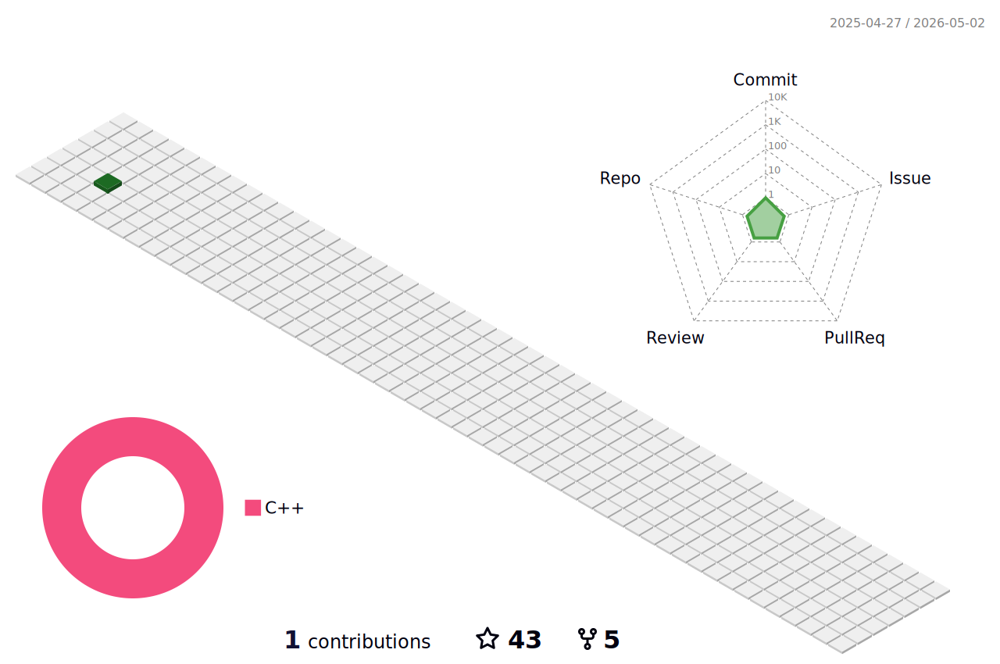

   

  
  

<h1 align="center">
  Hi there Squirtle Squad, U hungry for CODE? 
   
</h1>

## Project Gallery

| **Binary Analysis 👾**                             | **Binary Exploitation 💥**                             |
|:----------------------------------------------------:|:-------------------------------------------------------:|
|  |  |
| **AI 🤖**                                          | **Low-level Virtualization 🧊**                          |
|  |  |
| **DevOps ArgoCD Kubernetes 🕸️**                    | **Optimization Algorithms ⛓️**                           |
|  |  |
| **Operating Systems Development ✨**                  | **Network Architecture and Engineering 🖥**                |
|  |  |

## Github Stats &nbsp; 

 

  <a href="https://github.com/AndreIglesias/AndreIglesias">
    <picture>
      <source media="(prefers-color-scheme: dark)" srcset="./profile-3d-contrib/profile-night-view.svg">
      
    </picture>
  </a>

  

