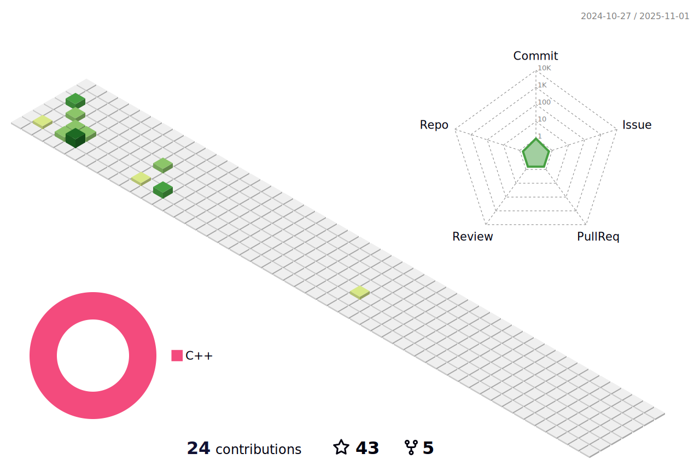

   

  
  

<h1 align="center">
  Hi there Squirtle Squad, U hungry for CODE? 
   
</h1>

## Github Stats &nbsp; 

### 3D Contribution Calendar &nbsp;
 

  <a href="https://github.com/AndreIglesias/AndreIglesias">
    <picture>
      <source media="(prefers-color-scheme: dark)" srcset="./profile-3d-contrib/profile-night-view.svg">
      
    </picture>
  </a>

 

  <a>
    <picture>
      <source media="(prefers-color-scheme: dark)" srcset="https://github-readme-activity-graph.vercel.app/graph?username=AndreIglesias&theme=high-contrast&hide_border=true">
      
    </picture>
  </a>

### Contribution Chart &nbsp;
 

  <a href="https://github.com/AndreIglesias/AndreIglesias">
    <picture>
      <source media="(prefers-color-scheme: dark)" srcset="https://github-readme-stats.vercel.app/api?username=AndreIglesias&hide_title=true&show_icons=true&include_all_commits=true&theme=dark">
      
    </picture>
  </a>

### Language Chart &nbsp;
 

    <a href="https://github.com/AndreIglesias/AndreIglesias">
    <picture>
      <source media="(prefers-color-scheme: dark)" srcset="https://github-readme-stats.vercel.app/api/top-langs/?username=AndreIglesias&layout=compact&theme=dark">
      
    </picture>
  </a>

<h6>Note : Does not indicate my skill level or anything like that, it's a GitHub metric of which languages have the most code on GitHub.</h6>

  

